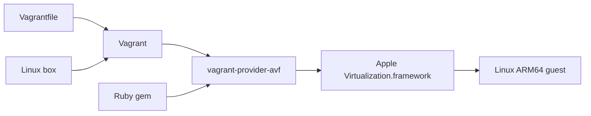

# vagrant-provider-avf
Run ARM64 Linux VMs on Apple Silicon Macs with Vagrant and Apple `Virtualization.framework`.

## Disclaimer

This project is not affiliated with, endorsed by, or sponsored by Apple Inc.

Apple, macOS, and Apple Silicon are trademarks of Apple Inc., registered in the U.S. and other countries.

## Quickstart


### What You Need

- macOS on Apple Silicon
- Vagrant
- Xcode command line tools
- the `vagrant-provider-avf` plugin
- one Linux box for the `avf` provider

Install the plugin:

```bash
vagrant plugin install vagrant-provider-avf
```

If you are working from a local checkout before the gem is published everywhere:

```bash
cd /Users/jim/Code/vagrant-provider-avf
version="$(ruby -I lib -e 'require \"vagrant_provider_avf/version\"; print VagrantPlugins::AVF::VERSION')"
mkdir -p build/gems
gem build vagrant-provider-avf.gemspec --output "build/gems/vagrant-provider-avf-${version}.gem"
vagrant plugin install "build/gems/vagrant-provider-avf-${version}.gem"
```

Add a box. If you are using locally built boxes from this repo, the examples below already use the local box names:

- `avf/ubuntu-24.04-arm64`
- `avf/almalinux-9-arm64`
- `avf/rocky-9-arm64`

If you are using a published box, swap the box name for your registry name, for example:

- `sodini-io/ubuntu-24.04-arm64`

## How It Fits Together



## Smallest Ubuntu Example

Create a `Vagrantfile`:

```ruby
Vagrant.configure("2") do |config|
  config.vm.box = "avf/ubuntu-24.04-arm64"
  config.vm.box_check_update = false

  config.vm.provider :avf do |avf|
    avf.cpus = 2
    avf.memory_mb = 2048
    avf.disk_gb = 8
    avf.headless = true
  end
end
```

Run it:

```bash
vagrant up --provider avf
vagrant ssh
vagrant halt
vagrant destroy -f
```

## AlmaLinux Example

```ruby
Vagrant.configure("2") do |config|
  config.vm.box = "avf/almalinux-9-arm64"
  config.vm.box_check_update = false

  config.vm.provider :avf do |avf|
    avf.guest = :linux
    avf.cpus = 2
    avf.memory_mb = 2048
    avf.disk_gb = 12
    avf.headless = true
  end
end
```

Use the same lifecycle commands:

```bash
vagrant up --provider avf
vagrant ssh -c 'cat /etc/os-release'
```

## Rocky Linux Example

```ruby
Vagrant.configure("2") do |config|
  config.vm.box = "avf/rocky-9-arm64"
  config.vm.box_check_update = false

  config.vm.provider :avf do |avf|
    avf.guest = :linux
    avf.cpus = 2
    avf.memory_mb = 2048
    avf.disk_gb = 12
    avf.headless = true
  end
end
```

Quick smoke check:

```bash
vagrant up --provider avf
vagrant ssh -c 'uname -a && whoami'
```

## Shared Folders And Tuning

This is the largest supported example today: more CPU and memory plus two read/write shared directories from the host into the guest.

```ruby
Vagrant.configure("2") do |config|
  config.vm.box = "avf/ubuntu-24.04-arm64"
  config.vm.box_check_update = false

  config.vm.synced_folder ".", "/vagrant"
  config.vm.synced_folder "examples", "/home/vagrant/examples", type: :avf_virtiofs

  config.vm.provider :avf do |avf|
    avf.guest = :linux
    avf.cpus = 4
    avf.memory_mb = 4096
    avf.disk_gb = 16
    avf.headless = true
  end
end
```

Those shared folders are read/write for the supported Linux guests. A simple verification is:

```bash
vagrant up --provider avf
vagrant ssh -c 'echo hello-from-guest > /vagrant/from-guest.txt'
cat from-guest.txt
```

## Supported Features

- `up`, `halt`, and `destroy`
- `ssh_info` and `vagrant ssh`
- NAT networking with localhost SSH forwarding
- stable forwarded SSH port reuse across restart when possible
- Linux shared folders through AVF virtiofs
- headless operation only
- configurable `cpus`, `memory_mb`, `disk_gb`, and `headless`

## Current Limits

- Linux only
- Apple Silicon macOS only
- no bridged networking
- no snapshots
- no GUI path
- no BSD guests right now

## Where To Go Next

- project scope and current limits: [docs/project-scope.md](/Users/jim/Code/vagrant-provider-avf/docs/project-scope.md)
- support matrix: [docs/guest-support.md](/Users/jim/Code/vagrant-provider-avf/docs/guest-support.md)
- testing and verification: [docs/testing.md](/Users/jim/Code/vagrant-provider-avf/docs/testing.md)
- releasing boxes and the plugin gem: [docs/releasing.md](/Users/jim/Code/vagrant-provider-avf/docs/releasing.md)
- enterprise Linux notes: [docs/enterprise-linux.md](/Users/jim/Code/vagrant-provider-avf/docs/enterprise-linux.md)
- example Vagrantfiles: [examples/README.md](/Users/jim/Code/vagrant-provider-avf/examples/README.md)

## Repository

- source: [https://github.com/sodini-io/vagrant-provider-avf](https://github.com/sodini-io/vagrant-provider-avf)
- issues: [https://github.com/sodini-io/vagrant-provider-avf/issues](https://github.com/sodini-io/vagrant-provider-avf/issues)
