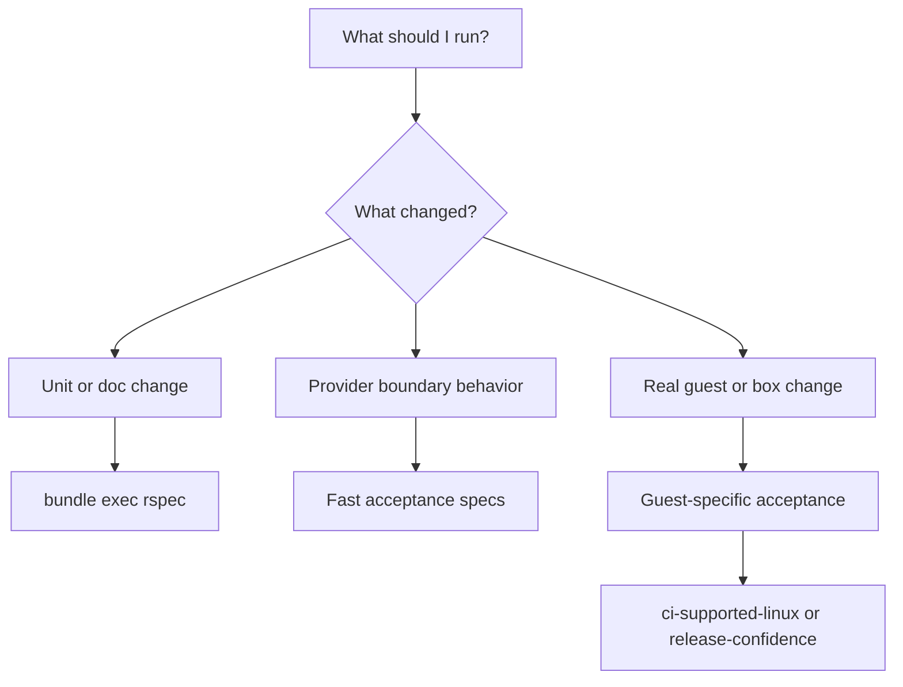

# Testing Guide

This repo has four main verification paths:

- the fast RSpec suite
- fast provider-boundary acceptance for the supported Linux feature surface
- explicit command verification for the supported Vagrant surface
- clean-home published install verification for released Linux boxes
- a real Ubuntu acceptance workflow
- a real AlmaLinux acceptance workflow
- a real Rocky Linux acceptance workflow
- one combined release-confidence gate for the supported Linux matrix

Use the smallest one that answers your question first.
The support matrix is in [docs/guest-support.md](/Users/jim/Code/vagrant-provider-avf/docs/guest-support.md).
The publish guide is in [docs/releasing.md](/Users/jim/Code/vagrant-provider-avf/docs/releasing.md).



## Prerequisites

### Fast RSpec suite

- Ruby
- Bundler
- `bundle install`

### Real Ubuntu acceptance

- Apple Silicon Mac
- macOS
- Xcode command line tools
- Vagrant
- Docker with Linux ARM64 support when the default Ubuntu box still needs to be built

### Real AlmaLinux acceptance

- Apple Silicon Mac
- macOS
- Xcode command line tools
- Vagrant
- `curl`
- `shasum`
- `qemu-img`
- `bsdtar`

### Real Rocky Linux acceptance

- Apple Silicon Mac
- macOS
- Xcode command line tools
- Vagrant
- `curl`
- `shasum`
- `qemu-img`
- `bsdtar`

## Fast Suite

Run:

```bash
bundle exec rspec
```

What success looks like:

- exit status `0`
- output ending with `0 failures`

Important gotcha:

- this run skips the hardware-backed acceptance specs unless `AVF_REAL_ACCEPTANCE=1` is set
- it also skips the post-publish registry-backed acceptance spec unless `AVF_REAL_PUBLISHED_ACCEPTANCE=1` is set

The fast suite is mostly unit tests.
It also includes provider-boundary acceptance specs for:

- lifecycle behavior
- direct-kernel Linux and disk-boot Linux
- Linux synced-folder selection and wiring

## Ubuntu

Build and package:

```bash
images/ubuntu/build-image
scripts/build-box
```

Command verification:

```bash
scripts/verify-vagrant-commands build/boxes/avf-ubuntu-24.04-arm64-0.1.0.box
```

That script checks the supported Vagrant commands directly. It verifies:

- `vagrant validate`
- `vagrant status`
- `vagrant up`
- `vagrant ssh`
- `vagrant ssh-config`
- `vagrant halt`
- `vagrant destroy`
- read/write shared-folder behavior through the guest lifecycle

Backward-compatible alias:

```bash
scripts/smoke-box build/boxes/avf-ubuntu-24.04-arm64-0.1.0.box
```

Real acceptance:

```bash
scripts/ci-ubuntu-acceptance
```

Success looks like:

- the verifier or acceptance command exits with status `0`
- guest SSH commands print:

```text
vagrant
aarch64
```

Important gotchas:

- `images/ubuntu/build-image` currently depends on Docker
- the supported Ubuntu path boots directly from the packaged kernel, initrd, and labeled ext4 root disk
- `scripts/verify-vagrant-commands` uses the current `VAGRANT_HOME`
- `scripts/run-acceptance-ubuntu` creates an isolated `VAGRANT_HOME`

## AlmaLinux

Build and package:

```bash
images/almalinux/build-image
scripts/build-almalinux-box
```

Command verification:

```bash
DISK_GB=12 BOX_NAME=avf/almalinux-9-arm64 scripts/verify-vagrant-commands build/boxes/avf-almalinux-9-arm64-0.1.0.box
```

Real acceptance:

```bash
scripts/ci-almalinux-acceptance
```

Important gotchas:

- this path is host-native and depends on `qemu-img`
- the supported flow uses the provider-generated Linux NoCloud seed disk at runtime
- the embedded box defaults set `disk_gb = 12`

## Rocky Linux

Build and package:

```bash
images/rocky/build-image
scripts/build-rocky-box
```

Command verification:

```bash
DISK_GB=12 BOX_NAME=avf/rocky-9-arm64 scripts/verify-vagrant-commands build/boxes/avf-rocky-9-arm64-0.1.0.box
```

Real acceptance:

```bash
scripts/ci-rocky-acceptance
```

## Supported Linux Matrix

Run all three real supported Linux acceptance workflows in sequence:

```bash
scripts/ci-supported-linux
```

Use this when you want one end-to-end system gate for the currently supported Linux matrix.
It uses temporary acceptance roots by default and cleans them on success unless `AVF_KEEP_FAILURE_ARTIFACTS=1` is set.

## Published Box Verification

Use this after the plugin gem and Linux boxes are already published.

Verify one clean public install path:

```bash
scripts/verify-published-box sodini-io/ubuntu-24.04-arm64 0.1.0
```

That path creates a clean `VAGRANT_HOME`, installs `vagrant-provider-avf` from RubyGems, adds the published `avf` box from the registry, and then runs the same command-level lifecycle verifier used for local box testing.

Verify the full published Linux matrix:

```bash
scripts/ci-published-supported-linux sodini-io 0.1.0
```

Or run the dedicated published acceptance spec wrapper:

```bash
scripts/post-release-confidence sodini-io 0.1.0
```

What success looks like:

- the script exits with status `0`
- each guest prints:

```text
vagrant
aarch64
```

Important gotchas:

- Ubuntu uses the normal `8` GB floor in the published verifier
- AlmaLinux and Rocky use `12` GB automatically in the published verifier
- this path downloads the plugin gem and the boxes into isolated temporary `VAGRANT_HOME` directories, so it will use noticeable disk while it runs
- `AVF_KEEP_FAILURE_ARTIFACTS=1` is useful here because the preserved `home/` and `work/` directories capture the exact clean-user environment that failed
- `scripts/post-release-confidence` enables `AVF_REAL_PUBLISHED_ACCEPTANCE=1` for the published acceptance spec automatically
- `scripts/ci-published-examples` verifies that the published plugin and boxes still work with the example Vagrantfiles under `examples/`

## Release-Confidence Gate

Run:

```bash
scripts/release-confidence
```

What it does:

- runs `bundle exec rspec`
- rebuilds the Ubuntu, AlmaLinux, and Rocky `.box` artifacts
- verifies the expected `.box` and `.sha256` files exist
- runs the full supported Linux system matrix

Use this before publishing or cutting a release candidate.

## Full-Confidence Gate

Run:

```bash
scripts/full-confidence sodini-io 0.1.0
```

What it does:

- runs `scripts/release-confidence`
- runs `scripts/post-release-confidence`

Use this when you want the strongest single launch gate in the repo:

- fast/unit coverage
- local box lifecycle confidence
- published box confidence
- published example Vagrantfile confidence

Important gotchas:

- this path is host-native and depends on `qemu-img`
- the supported flow uses the provider-generated Linux NoCloud seed disk at runtime
- the embedded box defaults set `disk_gb = 12`

## Acceptance Artifacts

The isolated acceptance wrappers honor:

- `AVF_KEEP_FAILURE_ARTIFACTS=1`
- `AVF_ACCEPTANCE_ROOT=/absolute/path/to/build/acceptance/ubuntu`

`AVF_KEEP_FAILURE_ARTIFACTS=1` preserves the isolated `VAGRANT_HOME` and smoke workspace after a failure.
`AVF_ACCEPTANCE_ROOT` places those artifacts in a deterministic location instead of a random temporary directory.

## Inspecting A Failed Machine

Run:

```bash
scripts/inspect-machine build/acceptance/ubuntu
```

Or point it directly at `.vagrant/machines/default/avf`.

What it prints:

- `machine_metadata.json`
- `avf-start-request.json`
- `avf-started.json`
- `avf-error.txt`
- `avf-helper.log`
- `console.log`
- matching host DHCP lease blocks from `/private/var/db/dhcpd_leases`

## Cross-Cutting Gotchas

- the Linux shared-folder path uses AVF virtiofs and is Linux-only
- the smoke and acceptance flows expect the forwarded SSH port to survive `halt` and a later `up`
- `ssh_info` only appears once the provider has real connection data from the guest or from validated DHCP-based discovery
- example Vagrantfiles under `examples/` are syntax-checked in the fast suite so they stay usable
